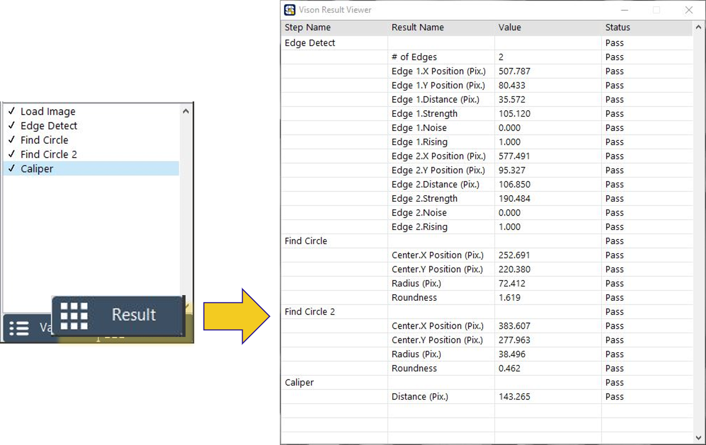
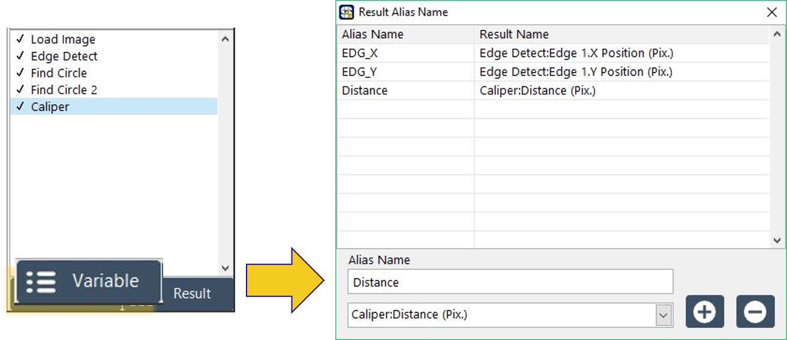

# 結果數據處理

### 添加影像功能後，我們能以其數據，做為判斷的標準，而 SmaVISION 提供了數據的總覽與輸出功能。

## 數據總覽表\(Result\)

點選 SmaVISION 右下角之 Result ，即可開啟 Vision Result Viewer，查看當前數據。

## 數據化名輸出\(Alias Name\)

點選 SmaVISION 右下角之 Variable ，即可開啟 Result Alias Name，選擇欲輸出的數據進行化名，以供Sequencer 呼叫 SmaVISION 時可讀取使用。

